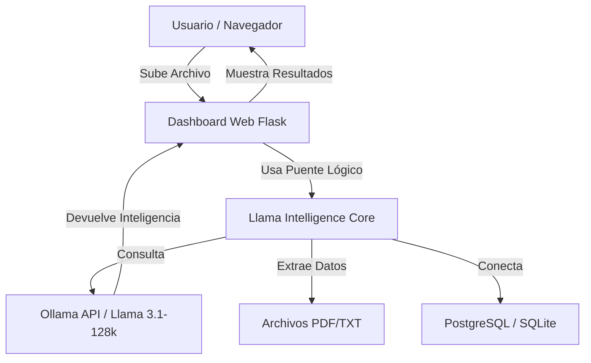

# Documentación Técnica: Llama Data Intelligence System

Este sistema es una solución integral de inteligencia artificial local diseñada para el análisis y resumen de grandesvolúmenes de datos utilizando **Llama 3.1** con una ventana de contexto extendida de **128k tokens**.

---

## 1. Visión General del Sistema
El proyecto transforma datos crudos (Bases de Datos, Logs de Transacciones y Libros) en inteligencia accionable sin necesidad de enviar datos a la nube, garantizando total privacidad y coste cero.

### Capacidades Principales:
- **Análisis de Bases de Datos**: Conexión a PostgreSQL y SQLite para explicar esquemas y datos sin escribir SQL.
- **Procesamiento de Libros/Documentos**: Resumen exhaustivo de archivos PDF y TXT de gran extensión.
- **Inteligencia de Datos Estructurados**: Detección automática de patrones en logs (como CSV o TXT por columnas) para generar reportes estadísticos.
- **Dashboard Web Modular**: Interfaz moderna para el usuario final que facilita la carga y visualización de resultados.

---

## 2. Arquitectura del Proyecto
El sistema es **modular**, separando la lógica de procesamiento de la interfaz de usuario:



---

## 3. Módulos Técnicos

### A. Core Engine (`src/`)
- **`db_analyzer.py`**: Utiliza SQLAlchemy para inspeccionar metadatos de bases de datos. Genera prompts que permiten a Llama entender la arquitectura del sistema.
- **`book_processor.py`**: Utiliza LangChain para cargar documentos. Posee un motor de "Prompt Engineering" que detecta si el texto es un libro narrativo o un registro de transacciones, adaptando su respuesta.

### B. Módulo Web (`web_dashboard/`)
- **`app.py`**: Servidor Flask que maneja la persistencia temporal de archivos y la comunicación asíncrona.
- **`logic/processor_bridge.py`**: Actúa como capa de abstracción para que la web pueda usar los motores del sistema sin dependencias circulares.
- **Interfaz (Static/Templates)**: Construida con Vanilla CSS ( Glassmorphism) y JS interactivo para una experiencia premium.

---

## 4. Guía de Uso Rápido

### Requisitos Previos
1. **Ollama**: Instalado y con el modelo creado:
   ```bash
   ollama create llama3.1-128k -f config/Modelfile
   ```
2. **Dependencias**: `pip install -r requirements.txt`

### Ejecución del Dashboard (Recomendado)
```bash
cd web_dashboard
python app.py
```
Accede a `http://localhost:5000` para empezar a resumir.

---

## 5. Estrategias de Optimización
- **Ventana de Contexto (128k)**: Permite leer aproximadamente 100,000 palabras de una sola vez.
- **Eficiencia de Memoria**: El sistema utiliza extracción selectiva de texto en PDFs para no saturar la VRAM de la tarjeta de video.
- **Escalabilidad**: Para documentos de millones de palabras, el sistema está preparado para implementar RAG (Recuperación Aumentada por Generación).

---
*Desarrollado con enfoque en Inteligencia de Datos Local y Privacidad.*
